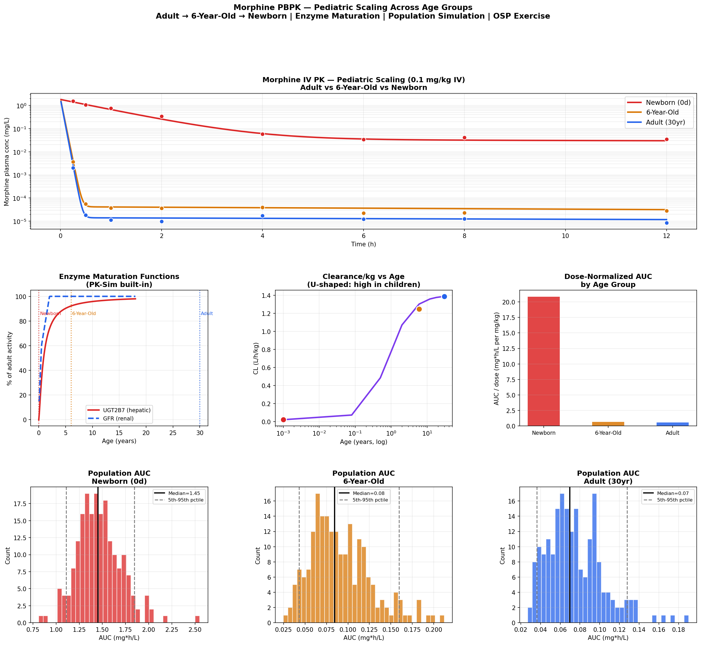

# Morphine PBPK — Pediatric Scaling Across Age Groups
**Adult → 6-Year-Old → Newborn | Enzyme Maturation | Population Simulation**

## Overview
Pediatric PBPK model for morphine implemented in Python and R, reproducing
the OSP PK-Sim v12 Scaling Across Age Groups exercise. Demonstrates how
physiological immaturity in neonates and children drives age-dependent
pharmacokinetics — a core concept in pediatric drug development and
FDA/EMA pediatric study requirements.

## Key Concept
Children are NOT small adults. Morphine PK changes dramatically with age:

| Parameter | Newborn | 6-Year-Old | Adult |
|---|---|---|---|
| UGT2B7 activity | ~10% adult | ~45% adult | 100% |
| GFR | ~15% adult | ~90% adult | 100% |
| CL/kg (L/h/kg) | Very low | Higher than adult | Reference |
| AUC (relative) | Highest | Lowest | Reference |

## Features
- Age-dependent physiological parameters (BW, CO, organ volumes/flows)
- UGT2B7 maturation function (Hill equation — mirrors PK-Sim built-in)
- GFR maturation function (sigmoidal)
- IVIVE of hepatic glucuronidation clearance
- Two-compartment PK simulation — adult, 6yr, newborn
- Population simulation (N=200 per age group, lognormal variability)
- AUC/Cmax distributions across age groups
- U-shaped CL/kg vs age curve
- Interactive Plotly dashboard

## Files
- `morphine_pediatric_scaling.ipynb` — Python implementation
- `morphine_pediatric_scaling.Rmd` — R Markdown implementation

## Results

## Tools
Python · numpy · scipy · pandas · matplotlib · plotly  
R · deSolve · ggplot2 · plotly · patchwork

## Regulatory Relevance
- FDA requires pediatric studies for most new drugs (PREA/BPCA)
- EMA Pediatric Investigation Plans (PIPs) mandate pediatric PBPK
- PBPK-informed dose selection avoids unnecessary pediatric trials
- Neonatal accumulation risk directly informs dosing interval selection

## OSP PK-Sim Parallel
This notebook reproduces the mathematical core of the OSP PK-Sim v12
exercise. In PK-Sim the same workflow uses:
- Built-in human physiological database with growth functions
- Automatic enzyme maturation for UGT2B7, CYP enzymes
- Individual scaling: File → Scale Individual → set age
- Population simulation with age-stratified analysis
- PK Parameter Analysis tool for AUC/Cmax boxplots

## Training Reference
OSP PK-Sim Course v12 — Scaling Across Age Groups  
Exercise: Morphine PK in Adults, Children, and Neonates

## Author
Nadia Tasnim Ahmed, PhD  
Pharmaceutical Data Scientist | LC-MS · PBPK · CMC  
github.com/ahmedn12
